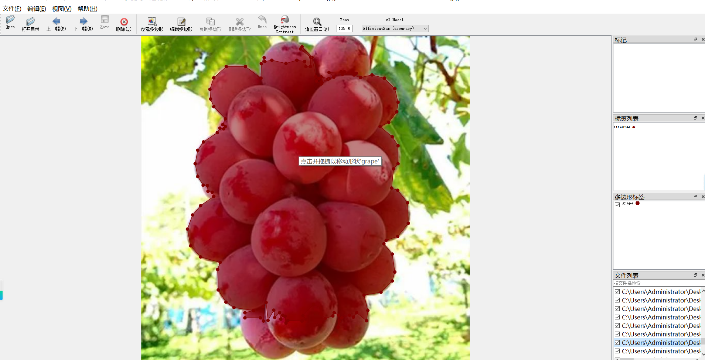
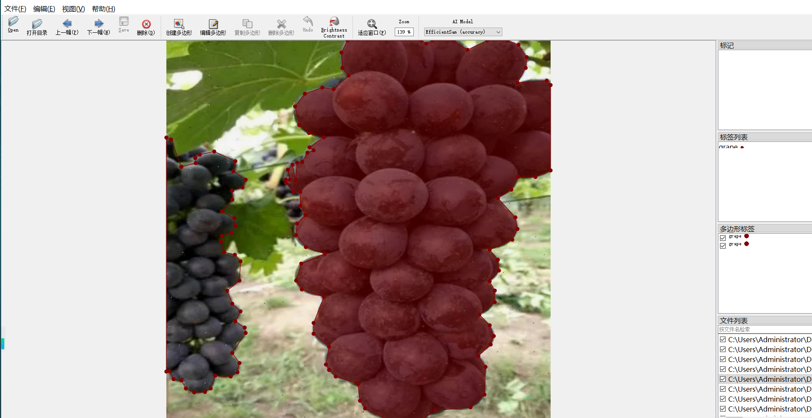
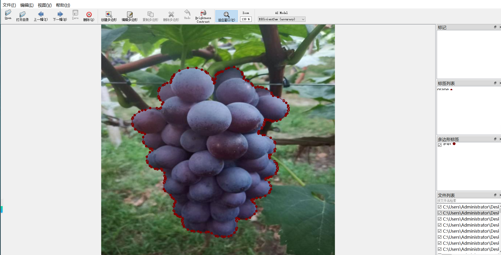

# Grape Segmentation Dataset 1617 imagesjsonformat

Grape Segmentation Dataset (1617 images, JSON format)

The dataset format is LabelMe format (without mask files, only containing jpg images and corresponding json files).

Number of images (jpg file count): 1617

Number of JSON files: 1617

Number of categories: 1

Annotation class names: ["grape"]

Number of boxes labeled in each category:

grape count = 2655

Total Frames: 2655

Using the labelling tool: Labelme=5.5.0

Repository: datasets-sl

Image resolution: 640x640

Rules for Markup: Draw a polygon around the category.

Important Note: You can open and edit the dataset using LabelMe. For JSON datasets, you need to convert them into Mask or Yolo format for semantic segmentation or instance segmentation.

Special Disclaimer: This dataset does not guarantee the accuracy of the trained models or weight files.

## Images

---

Here is a pay link on Stripe (https://buy.stripe.com/3cs8yP7sY87d0vu9AB). Please contact me lonlonago@foxmail.com after funding $89, and I will send you a complete data files, thank you!

